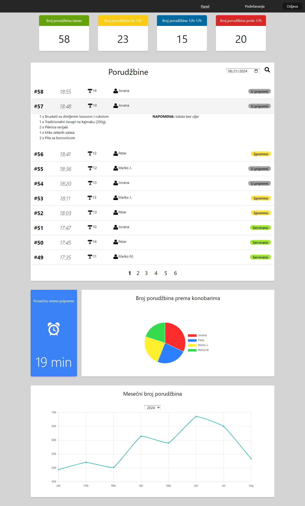

# Kitchen Display System

### Description

**Kitchen Display System** is a web application that provides restaurants a way to manage food orders in real time. Users can log in as: "waiter", "kitchen" or "admin". The "admin" users have access to all the orders and various statistics. The "waiter" and "kitchen" users can see only the currently active orders and their workflow would include:

- Waiter creating a new order
- Kitchen staff preparing the order
- Waiter serving (removing) the order

The Web API provides endpoints for authentication and getting the initial data with HTTP requests and all changes made by users are updated in real time with WebSockets.

### Technologies

- ASP.NET Core
- Entity Framework Core
- SignalR
- SQL Server
- React
- React Router DOM
- Chart.js
- Tailwind CSS

### Features in progress

- Admin functionalities: add/edit/delete entities

### Demo

### Screenshot

