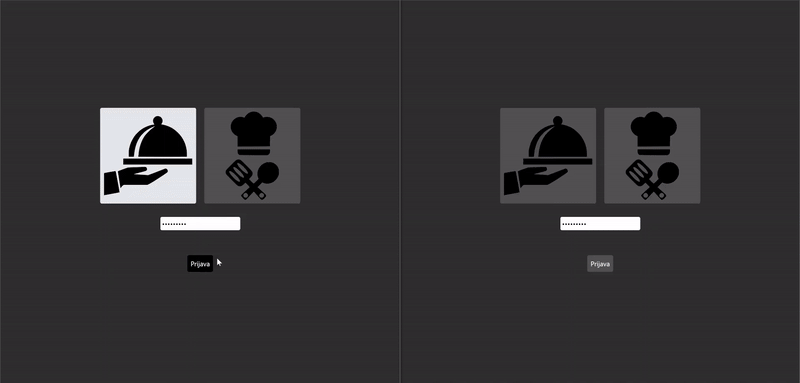

# Kitchen Display System

### Description

**Kitchen Display System** is a web application that provides restaurants a way to manage food orders in real time. Users can log in either as a "Waiter" or a "Kitchen" user and they both can see all the orders that are still active. The workflow would include:

- Waiter creating a new order
- Kitchen staff preparing the order
- Waiter serving (removing) the order

The Web API provides enpoints for authentication and getting the initial data with HTTP requests and all changes made by users are updated in real time with WebSockets.

### Technologies

- ASP.NET Core
- Entity Framework Core
- SignalR
- SQL Server
- React
- Tailwind CSS

### Features in progress

- Admin functionalities

### Demo

